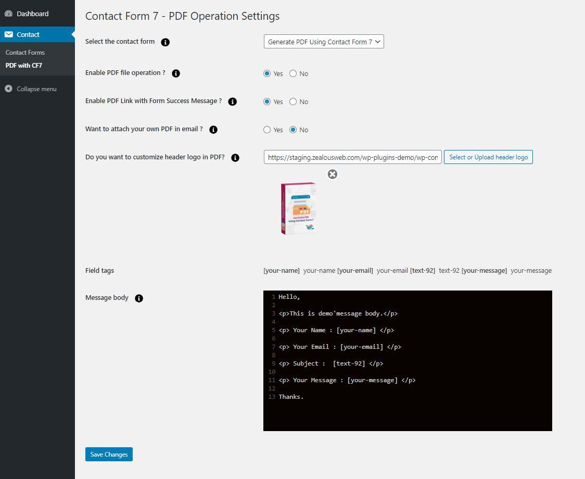
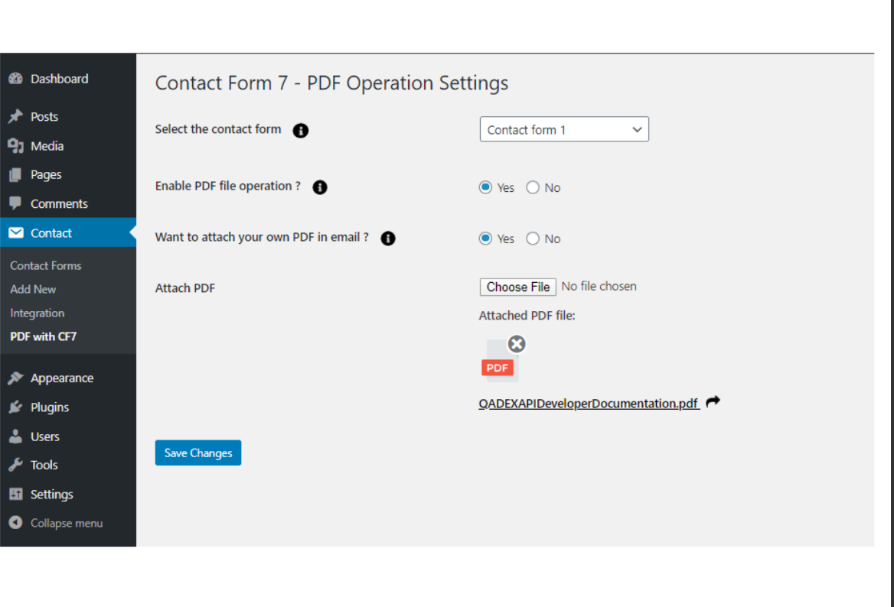

# generate-pdf-using-contact-form-7
Generate PDF using Contact Form 7 plugin provides an easier way to download PDF documents, open the PDF document file after the successful form submission.

Here, a user can set the document file (PDF) from the ‘Form Setting’ Page of each Contact form.

When the user fills the form and submits it, the same document will get open in a new tab. Once it gets opened, the user would be able to download it to the local system.

Also, in case an admin does not want any user to open it in-browser, admin can adjust settings and send that particular PDF as an email attachment.

**Note**
For PDF we have used MPDF library so in admin side it’s support Below HTML and CSS with editor to generate PDF.
https://mpdf.github.io/css-stylesheets/supported-css.html
https://mpdf.github.io/html-support/html-tags.html

**Features of Generate PDF using Contact Form 7**
- Attach PDF file to the Form Notifications Emails that are sent to the user and/or administrator, from the Admin side.
- In the message, the link of the attached PDF file is displayed, along with Thank You Message of the Form Submission
- Admin can add different PDFs with different Contact Forms and can create multiple forms.
- Admin can create their own PDF with submitted Data in the Form
- Admin can customize your PDF form by adding a logo on the Header and other relevant Form * Fields while sending a Thank You Message to the user.
- Ablity to Update PDF Header/Footer Text.
- Ability to add file option with our PDF attachement in mail.
- We can use Page Break and new content will be move on next pages in PDF.
- For Acceptance Field use particular tag in PDF editor then only it’s showing proper value. Ex. [acceptance-] Start tag as example then you can use any word for tags like [acceptance-terms-condition] OR [acceptance-policy] etc.
- You can set file name from admin also use any form tag instead of file name.
- Add Page number options in admin so you can add Text with PDF page number.
- Ability to set font size of PDF content.
- Compatibility of WordPress VIP.

[Learn more about the Pro version](https://store.zealousweb.com/generate-pdf-using-contact-form-7-pro)

<strong>[Demo for Generate PDF using Contact Form 7 Pro](https://demo.zealousweb.com/wordpress-plugins/generate-pdf-using-contact-form-7-pro/)</strong>

**OUR OTHER PLUGINS**

* <strong>[Accept PayPal Payments Using Contact Form 7 Pro](https://store.zealousweb.com/accept-paypal-payments-using-contact-form-7-pro)</strong>
* <strong>[Accept Stripe Payments Using Contact Form 7 Pro](https://store.zealousweb.com/accept-stripe-payments-using-contact-form-7-pro)</strong>
* <strong>[Accept Authorize.NET Payments Using Contact Form 7 Pro](https://store.zealousweb.com/accept-authorize-net-payments-using-contact-form-7-pro)</strong>
* <strong>[Accept Elavon Payments Using Contact Form 7 Pro](https://store.zealousweb.com/accept-elavon-payments-using-contact-form-7-pro)</strong>
* <strong>[Accept 2Checkout Payments Using Contact Form 7 Pro](https://store.zealousweb.com/accept-2checkout-payments-using-contact-form-7-pro)</strong>
* <strong>[Accept Sage Pay Payments Using Contact Form 7 Pro](https://store.zealousweb.com/accept-sage-pay-opayo-payments-using-contact-form-7-pro)</strong>
* <strong>[User Registration Using Contact Form 7 Pro](https://store.zealousweb.com/user-registration-using-contact-form-7-pro)</strong>
* <strong>[Abandoned Contact Form 7 Pro](https://store.zealousweb.com/abandoned-contact-form-7-pro)</strong>
* <strong>[Custom Product Options WooCommerce Pro](https://store.zealousweb.com/wordpress-plugins/custom-product-options-woocommerce-pro)</strong>

**Getting Help With WordPress**

If you have any questions about this plugin, you can post a thread in our WordPress.org forum. Please search existing threads before opening a new one or feel free to contact us at support@zealousweb.com

We also offer custom WordPress extension development and WordPress theme design services to fulfill your e-commerce objectives.

Our professional impassioned WordPress experts provide profound and customer oriented development of your project within short timeframes.

Thank you for choosing a Plugin developed by ZealousWeb!

# Installation
1. Download the plugin zip file from WordPress.org plugin site to your desktop / PC
2. If the file is downloaded as a zip archive, extract the plugin folder to your desktop.
3. With your FTP program, upload the plugin folder to the wp-content/plugins folder in your WordPress directory online
4. Go to the Plugin screen and find the newly uploaded Plugin in the list.
5. Click ‘Activate Plugin’ to activate it.

01. Select Contact Form
First, select the “Contact Form” from dropdown where you want to do an operation.

02. Enable PDF file Operation
This is the option form ON/OFF functionality for that selected Form.

03	Attach Own PDF in Mail - Yes
Select this option if you want to attach your own PDF file with Contact Form 7 Mails.

    3.1 Attach PDF
    You need to attach a PDF file using this option

04 Attach Own PDF in Mail - No
If you want to generate Custom PDF then you need to Select NO option and add below fields data.

    4.1	Field Tags
    Here is the list of Fields on the selected form. You can use that fields submission data add in custom PDF generate.

    4.2	PDF Header Logo
    You can upload your site logo or custom logo here which will be shown on top of the generated PDF.

    4.3	Message Body
    This is the main field where you can add all data which is used to generate PDF format. Here you can use HTML tags. Also, you can add your Custom HTML de‐ sign with this Box which will be created as PDF in email attachments.

