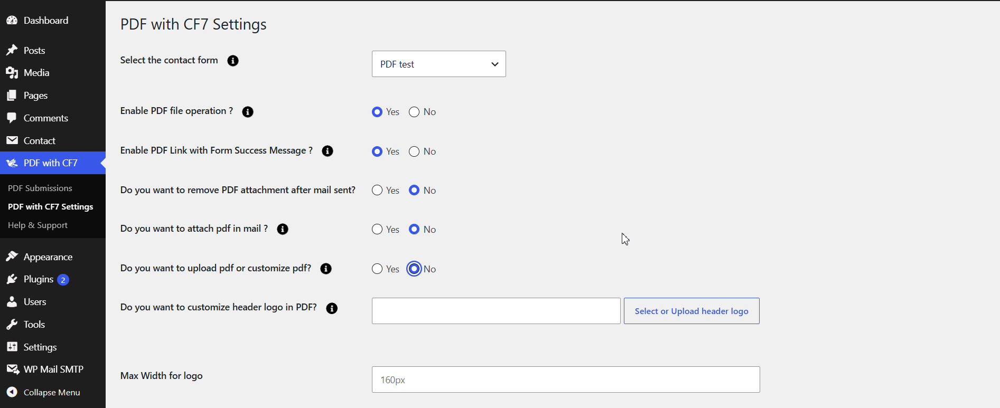
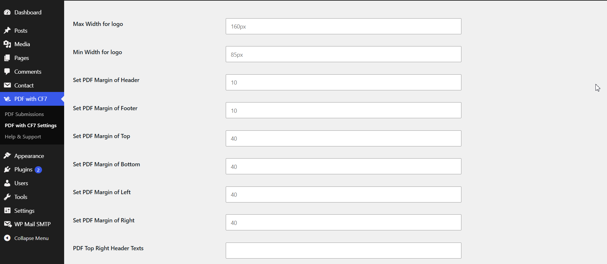
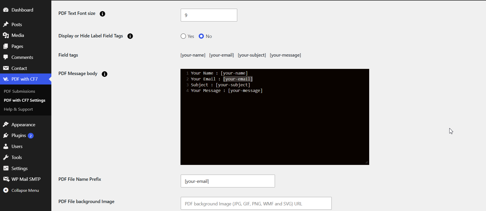
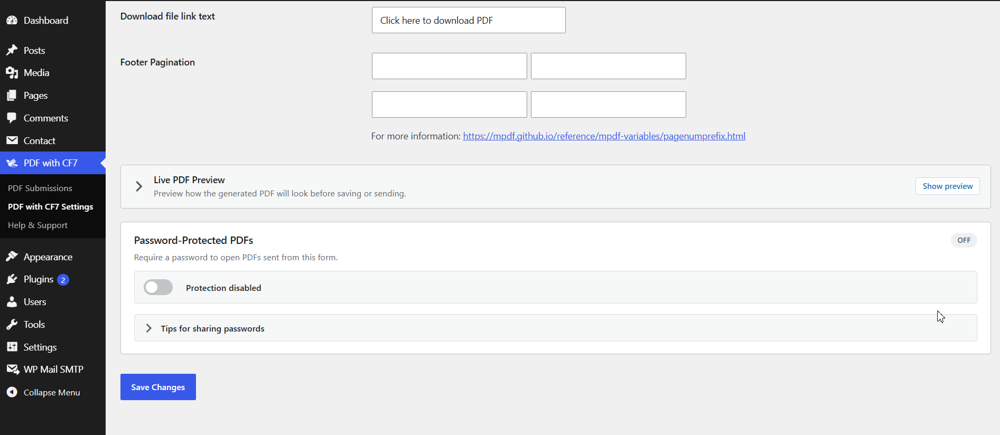
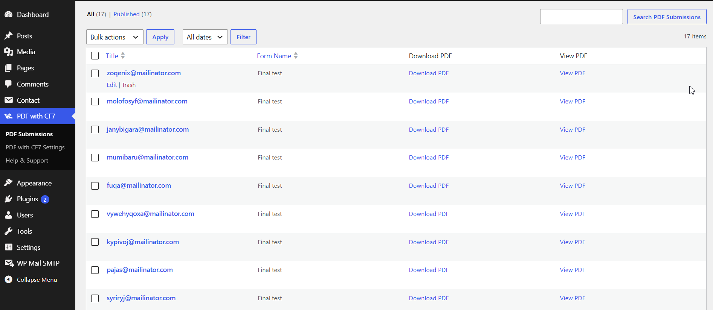
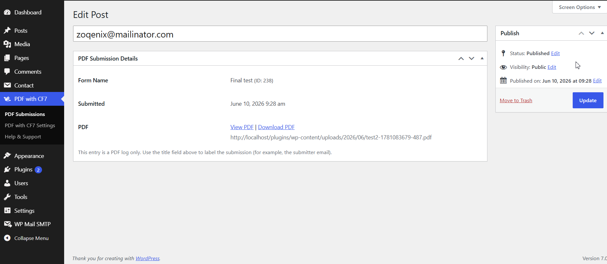
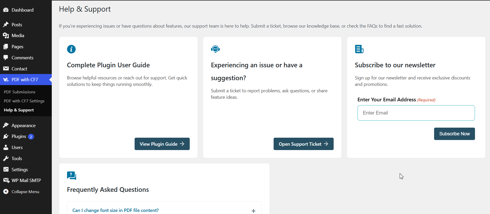

# Generate PDF using Contact Form 7

**Version:** 4.2.0  
**Requires at least:** WordPress 4.7  
**Requires PHP:** 5.6  
**Tested up to:** WordPress 7.0  
**License:** GPLv3 or later

Generate PDF using Contact Form 7 makes it simple to create PDFs for downloads, viewing, or sending as attachments after form submissions.

## Description

Generate PDF using Contact Form 7 plugin provides an easier way to download PDF documents and open the PDF document file after a successful form submission.

A user can set the document file (PDF) from the Form Settings page of each Contact Form 7 form. When the user fills out the form and submits it, the document opens in a new tab and can be downloaded to the local system.

If an admin does not want users to open the PDF in the browser, settings can be adjusted to send that PDF as an email attachment instead.

> **Note:** This plugin uses the mPDF library. The admin editor supports HTML and CSS for PDF generation.
>
> - [Supported CSS](https://mpdf.github.io/css-stylesheets/supported-css.html)
> - [Supported HTML tags](https://mpdf.github.io/html-support/html-tags.html)

## Features

- Attach PDF files to form notification emails sent to the user and/or administrator from the admin side.
- Display a link to the attached PDF in the form success message along with your thank you text.
- Add different PDFs to different Contact Form 7 forms and create multiple forms.
- Create custom PDFs with submitted form data.
- Customize PDFs with a header logo and relevant form fields.
- Update PDF header and footer text.
- Add file options along with PDF attachments in mail.
- Use page breaks so new content moves to the next page in the PDF.
- Show Acceptance field values using tags such as `[acceptance-terms-condition]` or `[acceptance-policy]` in the PDF editor.
- Set the PDF file name prefix from the admin side using any form field tag.
- Add page number options with custom text in the PDF.
- Set the font size of PDF content (default: 9px).
- **PDF Submission List** — keep all form submissions organized and accessible in PDF format.
- **Dedicated PDF Menu** — manage, view, and configure PDFs from a separate admin menu.
- **Live PDF Preview** — see how your PDF will look before saving or sending.
- **Password-Protected PDFs** — secure generated PDFs with a password.
- Access documentation, FAQs, and support options in one place.
- Submit support tickets and explore guides to resolve issues quickly.
- Stay updated with blogs and newsletter subscriptions.
- Compatibility with WordPress VIP.

**[Demo](https://demo.zealousweb.com/wordpress-plugins/generate-pdf-using-contact-form-7/)**

## Pro Features

### PDF Analytics

- PDF Analytics Dashboard: view all PDF activity in one place.
- Usage Tracking: monitor total PDFs generated, downloads, and emails sent.
- Error Monitoring: identify failed PDF generations.
- Visual Reports: analyze PDF data with charts (daily, monthly, yearly, custom range).
- Recent Activity: track user email, actions, and timestamps.
- Dashboard Widgets: enable or disable dashboard widgets as needed.

### Admin Experience

- Signature in PDF.
- Show or Hide Label Field Tags option.
- Cleaner, more user-friendly admin panel.
- New color scheme and branding with customizable colors.
- More text formatting and font options.
- PDF compression to reduce file size without losing quality.
- Accessibility enhancements.
- Faster PDF generation and optimized performance.
- Insert post or page title dynamically using `[_post_title]`.
- Add customizable watermark text to PDF files.
- Dynamically generate and send PDFs or use predefined PDF files.
- Enable or disable PDF attachments in emails.
- Display uploaded files from Contact Form 7 within the PDF.
- Send PDFs as attachments for both Mail 1 and Mail 2 with flexible email configuration.
- Allow users to download PDFs via a link after form submission.

### Design & Layout Customization

- Choose fonts for PDF content from supported fonts.
- Add signature fields and embed signatures as PNG or image files using shortcodes.
- Custom design options: background images, colors, gradients, text colors, and more.
- Built-in CSS editor for custom PDF styles.
- Page break tag for improved formatting.
- Customize header image position in PDF files.
- Manage headers, footers, and page sizes (A4, A3, Letter, etc.).
- RTL support for right-to-left languages.

### Security & Access Control

- Security updates for improved data protection.
- Tag for creating password-protected PDFs.

### Preview & Formatting

- PDF preview from the admin interface without form submission.
- Display dates in various formats using the PHP Date function.
- Support for Contact Form 7 mail tags in PDF content.

### Template & File Management

- PDF Template feature for selecting templates in settings.
- Complete list of created PDF forms with submitted data saved to the database.
- Import/export plugin settings across multiple sites.
- CSV export for form data submissions.
- Store PDFs on servers or third-party storage (Amazon S3, Google Drive, Dropbox).

**[Get Pro version](https://store.zealousweb.com/generate-pdf-using-contact-form-7-pro)** | **[Pro Demo](https://demo.zealousweb.com/wordpress-plugins/generate-pdf-contact-form-7-pro/)**

## Installation

1. Download the plugin zip file from the [WordPress.org plugin directory](https://wordpress.org/plugins/generate-pdf-using-contact-form-7/).
2. If the file is a zip archive, extract the plugin folder.
3. Upload the plugin folder to `wp-content/plugins` on your WordPress site.
4. Go to **Plugins** in the WordPress admin and find **Generate PDF using Contact Form 7**.
5. Click **Activate**.

## Screenshots

### 1. PDF with CF7 Settings — form selection and core options

Select a contact form and configure PDF operation, download link, email attachment, and header logo options.



### 2. PDF with CF7 Settings — logo and margins

Customize logo dimensions and PDF page margins (header, footer, top, bottom, left, right).



### 3. PDF with CF7 Settings — message body and file options

Set font size, show or hide label field tags, edit the PDF message body, file name prefix, and background image.



### 4. PDF with CF7 Settings — preview and password protection

Live PDF preview and password-protected PDF options.



### 5. PDF Submissions list

View all generated PDFs in one list with form name, download, and view links.



### 6. PDF Submission details

Open a single submission to see form details, submission date, and PDF view or download links.



### 7. Help & Support

Access the plugin guide, submit a support ticket, subscribe to the newsletter, and browse FAQs.



## Frequently Asked Questions

### Can I attach a PDF to Contact Form 7 notification emails?

Yes. From the admin side, you can attach a PDF file to form notification emails sent to the user and/or administrator.

### Is a PDF download link shown after form submission?

Yes. A link to the generated PDF can be displayed in the form success message along with your thank you text.

### Can I use different PDF settings for different Contact Form 7 forms?

Yes. You can configure a separate PDF for each contact form and create as many forms as you need.

### Can I generate a PDF with submitted form data?

Yes. You can create a custom PDF using the data submitted through the contact form.

### Can I add a logo and form fields to the PDF?

Yes. You can customize the PDF by adding a header logo and including relevant form field values in the PDF content.

### Can I update the header and footer content of the PDF?

Yes. You can add content to the PDF header and footer from the admin side, and set the header and footer margins in the PDF settings.

### Can I include uploaded files from the form with the PDF email attachment?

Yes. The plugin supports adding file options along with the PDF attachment in mail.

### How do I add a page break in the PDF?

You can use a page break in the PDF message body so new content moves to the next page.

### How do I show Acceptance field values in the PDF?

Use a tag that starts with `[acceptance-]` in the PDF editor. For example, `[acceptance-terms-condition]` or `[acceptance-policy]`, matching your acceptance field name.

### Can I set a custom PDF file name?

Yes. You can set the PDF file name prefix from the admin settings and use any form field tag as part of the file name.

### Can I add page numbers to the PDF?

Yes. Page number options are available in the admin settings so you can display custom text with the PDF page number.

### Can I change font size in PDF file content?

Yes. The default font size is 9px, but you can change it from the admin side.

### Where can I view past PDF submissions?

The PDF Submission List keeps all your form submissions organized and accessible in PDF format for easy viewing and record-keeping.

### Is there a dedicated menu for managing PDFs in the WordPress admin?

Yes. A separate PDF menu in the WordPress admin dashboard lets you quickly manage, view, and configure PDFs.

### Can I preview the PDF before saving or sending?

Yes. Live PDF Preview lets you see exactly how your PDF will look before saving or sending.

### Can I password-protect generated PDFs?

Yes. You can secure generated PDFs with a password to control who can access sensitive information.

### Where can I find plugin documentation and support?

The Help & Support section provides documentation, FAQs, support ticket submission, guides, blogs, and newsletter subscription options in one place.

### Is this plugin compatible with WordPress VIP?

Yes. The plugin is compatible with the WordPress VIP platform.

### How do I upload mPDF TTF fonts?

To keep the plugin size manageable, common TTF fonts are included. If you see an error such as *Cannot find TTF TrueType font file 'XB Riyaz.ttf' in configured font directories*, download the missing font from the [mPDF ttfonts directory](https://github.com/mpdf/mpdf/tree/development/ttfonts) and upload it to:

```
wp-content/plugins/generate-pdf-using-contact-form-7/inc/lib/mpdf/vendor/mpdf/mpdf/ttfonts
```

**How-to video:** https://www.awesomescreenshot.com/video/17025362?key=99cbec8974ee85fdad75e8cea60a97d6

## Changelog

### 4.2.0

- PDF Submission List: keep all form submissions organized and accessible in PDF format.
- Dedicated PDF Menu in Admin Panel for managing PDFs from a separate admin menu.
- Live PDF Preview before saving or sending.
- Password-Protected PDFs for sensitive information.
- Help resources: documentation, FAQs, and support options in one place.
- Support tickets and guides for faster issue resolution.
- Blogs and newsletter subscriptions for updates.
- Tested with WordPress 7.0.

### 4.1.7

- Tested with WordPress 7.0.
- Fix: sanitize PDF filenames so characters such as `/` and `#` in form fields no longer cause errors or broken download links.

### 4.1.6

- Added Show or Hide Label Field Tags option.

## Other Plugins

- [Abandoned Contact Form 7 Pro](https://store.zealousweb.com/wordpress-plugins/abandoned-contact-form-7-pro)
- [Accept 2 Checkout Payments Using Contact Form 7 Pro](https://store.zealousweb.com/wordpress-plugins/accept-2checkout-payments-using-contact-form-7-pro)
- [Accept Authorize.NET Payments Using Contact Form 7 Pro](https://store.zealousweb.com/wordpress-plugins/accept-authorize-net-payments-using-contact-form-7-pro)
- [Accept Elavon Payments Using Contact Form 7 Pro](https://store.zealousweb.com/wordpress-plugins/accept-elavon-payments-using-contact-form-7-pro)
- [Accept PayPal Payments Using Contact Form 7 Pro](https://store.zealousweb.com/wordpress-plugins/accept-paypal-payments-using-contact-form-7-pro)
- [Accept Sagepay (Opayo) Payments Using Contact Form 7 Pro](https://store.zealousweb.com/wordpress-plugins/accept-sage-pay-opayo-payments-using-contact-form-7-pro)
- [Accept Stripe Payments Using Contact Form 7 Pro](https://store.zealousweb.com/wordpress-plugins/accept-stripe-payments-using-contact-form-7-pro)
- [Custom Product Options WooCommerce Pro](https://store.zealousweb.com/wordpress-plugins/custom-product-options-woocommerce-pro)
- [Generate PDF Using Contact Form 7 Pro](https://store.zealousweb.com/wordpress-plugins/generate-pdf-using-contact-form-7-pro)
- [Smart Appointment & Booking Pro](https://store.zealousweb.com/wordpress-plugins/smart-appointment-booking-pro)
- [Smart Showcase for Google Reviews Pro](https://store.zealousweb.com/wordpress-plugins/smart-showcase-for-google-reviews-pro)
- [User Registration Using Contact Form 7 Pro](https://store.zealousweb.com/wordpress-plugins/user-registration-using-contact-form-7-pro)

## Support

If you have questions about this plugin, post in the [WordPress.org support forum](https://wordpress.org/support/plugin/generate-pdf-using-contact-form-7/) or email [support@zealousweb.com](mailto:support@zealousweb.com).

Thank you for choosing a plugin developed by **[ZealousWeb](https://www.zealousweb.com)**.
